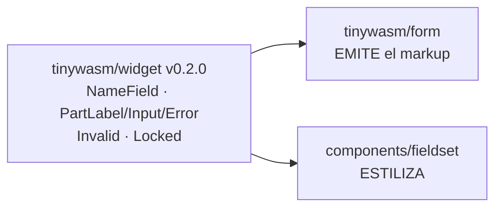

> Este plan se despacha con el flujo CodeJob. Ver skill: **agents-workflow**.

# Plan — `tinywasm/form`: anatomía de `widget` y estados `data-*`

## 🚦 Bloqueo previo — no empieces sin esto

Este plan **requiere `github.com/tinywasm/widget` v0.2.0 publicado**, que es quien aporta
`NameField`, `PartLabel`, `PartInput`, `PartError` y `PartRadioGroup`.

Plan de esa versión: <https://github.com/tinywasm/widget/blob/main/docs/PLAN.md>

Si `go get github.com/tinywasm/widget@v0.2.0` falla porque la versión no existe todavía,
**detente y repórtalo**. No declares esas constantes localmente en `form` "mientras tanto": ese
parche local es exactamente el defecto que el cambio elimina.

---

## ⚠️ 0. Alcance — LEE ESTO ANTES DE TOCAR NADA

`form` deja de traer CSS y de inventar nombres de clase. Pasa a **emitir** la anatomía que
define `widget` y los estados `widget.Invalid` / `widget.Locked` como atributos `data-*`.
Quien pinta ese esqueleto es `components/fieldset`, en otro repo.

**PROHIBIDO — no hagas nada de esto:**

| Prohibición | Motivo |
|---|---|
| Declarar en `form` un `widget.Name` o `widget.Part` propios | La anatomía la posee `widget` v0.2.0. Duplicarla aquí reabre el acoplamiento por string que este cambio elimina. |
| Importar `github.com/tinywasm/css` en cualquier archivo | Es justo lo que este plan elimina. `form` es una librería de datos/markup: no depende de una librería de estilo. |
| Importar `github.com/tinywasm/widget/style` | Arrastra `css` de forma transitiva. `form` importa **solo** `github.com/tinywasm/widget` (paquete raíz), que depende únicamente de `tinywasm/fmt`. |
| Añadir una dependencia a `github.com/tinywasm/components` | Dirección de dependencia invertida. `fieldset` conoce a `widget`, no a `form`. |
| Usar la librería estándar de Go | `form` compila a WASM. Usa `github.com/tinywasm/fmt`. El DOM solo por `github.com/tinywasm/dom`. |
| Quitar los atributos nativos `disabled` / `readonly` | Son **comportamiento**, no estilo. Se quedan tal cual, además de los nuevos `data-*`. |
| Tocar `validate.go`, `validate_struct.go`, `sync.go`, `load.go` o el paquete `input/` | Fuera de alcance. Este plan solo toca markup, estados y dependencias. |
| Usar `go test` | En este repo se usa `gotest`. |

**Anti-footgun:** `form` compila a WASM, así que la regla *"sin stdlib"* **sí aplica aquí** (al
revés que en `tinywasm/ssr`, que es backend). El paquete raíz `github.com/tinywasm/widget` es
seguro para WASM: su única dependencia es `tinywasm/fmt`.

---

## 1. Estado actual y qué está roto

Hoy `form` emite clases con strings literales y codifica el estado *inválido* como una **clase**:

```go
// render_input.go (actual)
container := dom.NewElement("div").Class("tw-field")
...
errSpan := dom.NewElement("span").
	Class("tw-field-error").
	BindClassFunc("tw-field-error--visible", func() bool { return fc.err.Get() != "" })
...
group := dom.NewElement("div").Class("tw-radio-group")
```

Y trae su propio CSS en `css.go` (`RenderCSS() *css.Stylesheet`, función libre).

`components/fieldset` es, por diseño declarado, **la piel global de los formularios**: existe
solo para estilizar `.tw-field`. Con la migración de `components` al DSL visual, `fieldset` pasa
a emitir selectores derivados de un `widget.Name` (`.nombre__parte`) y estados
`[data-invalid="true"]`. Si `form` sigue emitiendo `tw-field-error--visible` y ningún `data-*`,
**los dos lados dejan de encajar y los formularios se quedan sin estilo, sin que nada falle en
build**.

---

## 2. La decisión de diseño (ya tomada, no la reabras)

**`widget` posee la anatomía; `form` la emite; `components/fieldset` la estiliza.**



Ninguna arista entre `form` y `components`: las dos conocen a `widget`, no entre sí. Es el
diagrama de dependencias del plan maestro (§5.3) sin modificar.

---

## Etapa 1 — `go.mod`

Archivo: `go.mod`

1. **Añadir**: `github.com/tinywasm/widget v0.2.0`
2. **Eliminar**: `github.com/tinywasm/css v0.1.4`

Ejecutar `go mod tidy`. Si `css` reaparece, es que quedó un import — encuéntralo y quítalo
(la etapa 4 borra el único que hay).

**Aclaración, para que no dudes:** el `go.mod` del propio módulo `widget` lista
`github.com/tinywasm/css // indirect`, porque su **subpaquete** `widget/style` sí importa `css`.
Eso **no** contamina a `form`: importando solo el paquete raíz `github.com/tinywasm/widget`, el
pruning de módulos de Go deja el `go.mod` de `form` con `widget` + `fmt` y **sin `css`**.
Verificado empíricamente antes de escribir este plan. No añadas `css` "por si acaso" ni te
alarmes al verlo en el `go.mod` de `widget`.

---

## Etapa 2 — `states.go` (archivo NUEVO)

Archivo: `states.go` (raíz del módulo). **Sin build tag**: el markup lo escriben WASM y SSR.

Solo cachea los dos pares de estado. **La anatomía no se declara aquí**: se consume de `widget`.

```go
package form

import "github.com/tinywasm/widget"

// Pares (clave, valor) de los estados que el campo publica en el DOM. widget.State.Attr()
// devuelve exactamente el par sobre el que selecciona la hoja de estilos, de modo que markup
// y CSS coinciden por construcción y no por convención.
var (
	attrInvalid = widget.Invalid.Attr() // data-invalid = "true"
	attrLocked  = widget.Locked.Attr()  // data-locked  = "true"
)
```

No declares constantes de nombre ni de parte. Vienen de `widget`:

| Símbolo de `widget` | Clase que produce |
|---|---|
| `widget.NameField.Root()` | `tw-field` |
| `widget.NameField.Class(widget.PartLabel)` | `tw-field__label` |
| `widget.NameField.Class(widget.PartInput)` | `tw-field__input` |
| `widget.NameField.Class(widget.PartError)` | `tw-field__error` |
| `widget.NameField.Class(widget.PartRadioGroup)` | `tw-field__radio-group` |

La clase raíz sigue siendo `tw-field`, así que los tests y consumidores existentes que la buscan
siguen pasando sin cambios.

---

## Etapa 3 — Clases derivadas en `render_input.go`

Archivo: `render_input.go`. Sustituye **todos** los literales de clase:

| Actual | Reemplazo |
|---|---|
| `dom.NewElement("div").Class("tw-field")` | `dom.NewElement("div").Class(widget.NameField.Root().String())` |
| el `<label>` (hoy sin clase) | añadir `.Class(widget.NameField.Class(widget.PartLabel).String())` |
| `.Class("tw-field-error")` | `.Class(widget.NameField.Class(widget.PartError).String())` |
| `dom.NewElement("div").Class("tw-radio-group")` | `.Class(widget.NameField.Class(widget.PartRadioGroup).String())` |

Además, en `renderInput`, `renderSelect` y `renderDatalist`, añade al elemento de control:

```go
el.Class(widget.NameField.Class(widget.PartInput).String())
```

`widget.Class` ya expone `String()`, así que no hace falta conversión manual: `dom.Element.Class`
recibe `...string`.

**No debe quedar ningún literal de clase en el paquete.** Criterio 2 de §7.

---

## Etapa 4 — Estados `data-*` en vez de la clase `--visible`

Archivo: `render_input.go`

### 4.1 Borrar la clase de estado

Elimina por completo este binding del `errSpan`:

```go
BindClassFunc("tw-field-error--visible", func() bool { return fc.err.Get() != "" })
```

La visibilidad del error pasa a decidirla la hoja de estilos a partir del estado del campo.

### 4.2 Emitir los estados en el contenedor

En `Render()`, sobre `container`, tras asignarle la clase:

```go
container.
	BindAttrFunc(attrInvalid.Key, func() string {
		if fc.err.Get() != "" {
			return attrInvalid.Value
		}
		return ""
	}).
	BindAttrFunc(attrLocked.Key, func() string {
		if fc.isDisabledOrLocked() {
			return attrLocked.Value
		}
		return ""
	})
```

### 4.3 ⚠️ Usa `BindAttrFunc`, NUNCA `BindAttrBoolFunc`

Esto es un footgun real y verificado, no una preferencia de estilo:

- `BindAttrBoolFunc` emite el atributo **sin valor**: `data-invalid=""` (en SSR
  `fmt.KeyValue{Key: name, Value: ""}`, en WASM `ref.SetAttr(name, "")`).
- La hoja generada por `widget/style` selecciona con **valor exacto**:
  `.tw-field[data-invalid="true"]`.
- `[data-invalid="true"]` **no casa** con `data-invalid=""` → el estilo del estado nunca se
  aplica y **nada falla**. Es exactamente el fallo silencioso que todos estos planes existen
  para eliminar.

`BindAttrFunc` sí escribe el valor, y devolver `""` deja el atributo presente pero vacío, que
tampoco casa con el selector — que es el comportamiento correcto para "estado apagado".

### 4.4 Lo que NO se toca

`el.BindAttrBoolFunc("disabled", fc.isDisabledOrLocked)` y `el.Attr("readonly", "")` se quedan
**tal cual**: son atributos HTML nativos con semántica de comportamiento (bloquean la entrada
del usuario), no marcadores de estilo. `data-locked` es adicional, no sustituto.

---

## Etapa 5 — Borrar `css.go`

Borra el archivo `form/css.go` entero. Contiene la función libre
`RenderCSS() *css.Stylesheet` y el único `import "github.com/tinywasm/css"` del módulo.

**Verificado antes de escribir este plan:** ningún paquete del ecosistema llama a
`form.RenderCSS()`. No hay que actualizar a ningún consumidor.

Consecuencia en `tinywasm/ssr` (correcta y deseada): sin `css.go`, el paquete `form` deja de
declarar cualquier proveedor SSR, así que el guard `HasAnyFeature` lo omite y ni siquiera se
importa en el extractor generado. Y como `form` **no** importa `widget/style`, tampoco dispara
el diagnóstico de "importa `widget/style` pero no declara `Style()`".

---

## Etapa 6 — Tests

Directorio: `tests/` (donde ya viven los tests de este repo). Usa `gotest`, nunca `go test`.
Assertions de stdlib solamente, según `AGENTS.md`.

### 6.1 `tests/anatomy_test.go` (nuevo)

1. El HTML renderizado de un campo contiene `class="tw-field"` — la clase raíz no cambió.
2. Contiene la clase de la parte `label` (`tw-field__label`).
3. Contiene la clase de la parte `error` (`tw-field__error`).
4. Un campo de tipo radio contiene `tw-field__radio-group`.

### 6.2 `tests/state_attrs_test.go` (nuevo)

Este es el test que protege el footgun de §4.3. Renderiza a HTML (SSR) y asevera **sobre el
string**:

1. Campo válido y desbloqueado → el HTML **no** contiene `data-invalid="true"`.
2. Campo con error → el HTML **sí** contiene, literal, `data-invalid="true"`.
3. Formulario bloqueado (`Form.SetLocked(true)`) → el HTML contiene `data-locked="true"`.
4. El HTML **no** contiene en ningún caso `tw-field-error--visible`.

Aseverar la cadena `data-invalid="true"` **completa, con el valor**, no solo la clave: es
precisamente la diferencia entre `BindAttrFunc` y `BindAttrBoolFunc`.

### 6.3 Los tests existentes

Los de `tests/` deben seguir pasando. Si alguno busca `tw-field-error--visible`, actualízalo al
estado `data-invalid`; si alguno busca `class="tw-field"`, **debe seguir pasando sin tocarlo**.

---

## 7. Criterios de aceptación — verificables con grep

1. `gotest` en verde, incluidos los dos tests nuevos.
2. `grep -rn '\.Class("' --include='*.go' .` → **vacío** fuera de `tests/` y `example/`.
3. `grep -rn "tinywasm/css" --include='*.go' .` → **vacío**.
4. `grep -n "tinywasm/css" go.mod` → **vacío**.
5. `grep -rn "tinywasm/widget/style\|tinywasm/components" --include='*.go' .` → **vacío**.
6. `grep -rn "widget.Name(\|widget.Part(" --include='*.go' .` → **vacío**: `form` consume la
   anatomía, no la declara.
7. `ls css.go` → **no existe**.
8. `grep -rn "tw-field-error--visible" .` → **vacío**.
9. `grep -rn "BindAttrBoolFunc" --include='*.go' .` → solo las apariciones de `disabled`
   preexistentes; **ninguna** con `data-invalid` ni `data-locked`.
10. `GOOS=js GOARCH=wasm go build ./...` compila.

---

## 8. Contraparte en `components` (OTRO repo — no lo toques desde aquí)

Para cerrar el circuito, `tinywasm/components` debe pasar `fieldset/css.go` a
`style.Of(widget.NameField)` y usar `widget.PartLabel` / `widget.PartInput` / `widget.PartError`
en sus `Part(...)`. Sus `When(widget.Locked, …)` / `When(widget.Invalid, …)` ya existen y, a
partir de este plan, **sí** encuentran los atributos en el DOM.

`components` **no** añade dependencia a `form`: ambos conocen `widget`.

Contexto: <https://github.com/tinywasm/components/pull/14>

**No incluyas esos cambios en este PR.** Este plan se cierra dentro de `tinywasm/form`.

---

## 9. Checklist de calidad Go (obligatorio)

- **Sin strings repetidos.** Toda clase sale de `widget.NameField`; toda clave de estado sale de
  `attrInvalid` / `attrLocked`. Ningún literal `"tw-field..."` ni `"data-invalid"` en la lógica.
- **Sin stdlib**: `github.com/tinywasm/fmt` para todo. DOM solo por `github.com/tinywasm/dom`.
- **Errores** con `fmt.Err(...)`.
- **Cero `any`, cero `map`** en API nueva (regla del repo).

---

## 10. Tabla de etapas

| # | Etapa | Archivos | Gate |
|---|---|---|---|
| 0 | *(bloqueo)* `widget` v0.2.0 publicado | — | `go get github.com/tinywasm/widget@v0.2.0` |
| 1 | Dependencias | `go.mod`, `go.sum` | `go build ./...` |
| 2 | Estados cacheados | `states.go` (nuevo) | compila |
| 3 | Clases derivadas | `render_input.go` | compila |
| 4 | Estados `data-*` | `render_input.go` | compila |
| 5 | Borrar el CSS | `css.go` (borrado) | `go mod tidy` sin `css` |
| 6 | Tests | `tests/anatomy_test.go`, `tests/state_attrs_test.go` (nuevos) | `gotest` verde |

Secuenciales, ninguna paralela. La 6 es el gate real.

---

## 11. Anexo — código actual de referencia

`render_input.go`, tal como está hoy (lo que las etapas 3 y 4 modifican):

```go
func (fc *fieldComponent) Render() *dom.Element {
	container := dom.NewElement("div").Class("tw-field")

	if lbl := fc.labelText(); lbl != "" {
		container.Child(dom.NewElement("label").
			Attr("for", fc.Input.GetID()).
			Text(lbl))
	}
	...
	errSpan := dom.NewElement("span").
		ID(fc.Input.ErrorID()).
		Class("tw-field-error").
		Attr("aria-live", "polite").
		BindText(fc.err).
		BindClassFunc("tw-field-error--visible", func() bool {
			return fc.err.Get() != ""
		})

	container.Child(errSpan)
	return container
}

// isDisabledOrLocked ya existe y es la fuente de verdad de "bloqueado":
func (fc *fieldComponent) isDisabledOrLocked() bool {
	return fc.Input.IsDisabled() || (fc.locked != nil && fc.locked.Get())
}
```

`css.go` completo, que la etapa 5 borra:

```go
//go:build !wasm

package form

import "github.com/tinywasm/css"

func RenderCSS() *css.Stylesheet {
	return css.NewStylesheet(
		css.Rule(".tw-field", ...),
		css.Rule(".tw-field-error", ...),
		css.Rule(".tw-field-error--visible", ...),
	)
}
```
